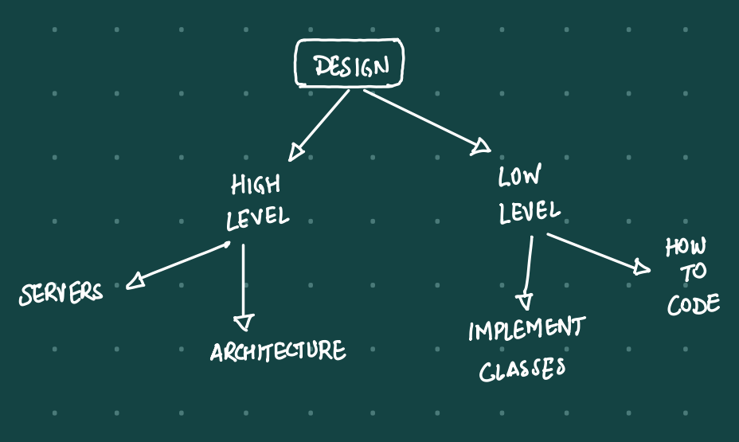
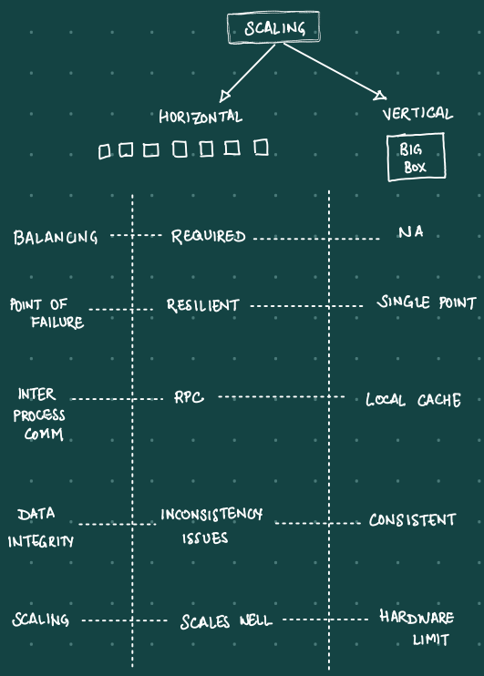
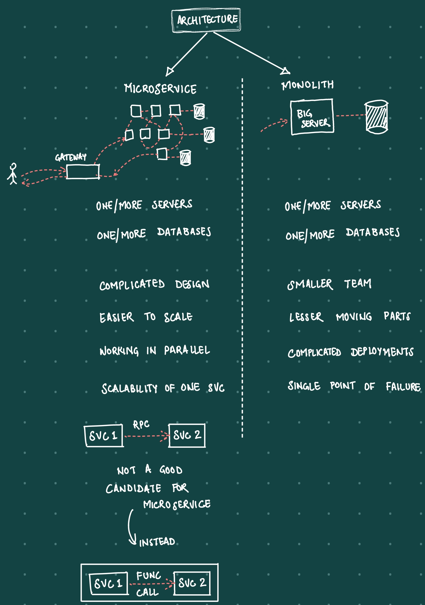
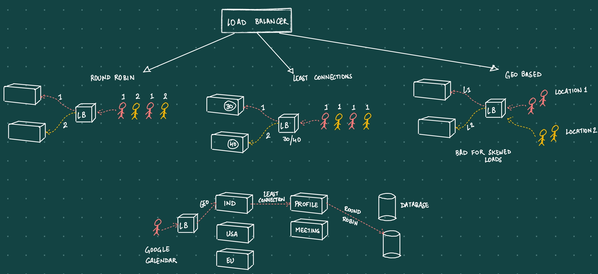

# System Design
Important Terms
- Micro service architecture
- Distributed system
    - partitioning
- Load balancer
- Decoupling
- Logging and Metrics
- Extensible

Design
- High level
    - servers
    - architecture
- Low level
    - implement classes
    - how to code
    - algo

## Scaling
Types of scaling
- Horizontal
- Vertical

## Architecture
Types of architecture
- Microservice
- Monolith

## Load Balancer
Concept of load balancing at different levels of understanding:
**1. Basic:** 
- Imagine you and your friends are at a party 
- there's a big cake to share
- only one friend tries to cut and serve all the pieces
    - takes a long time and they might get tired
- But if 10 friends takes a turn
    - the cake gets served faster and 
    - no one gets too tired. 
- That's what load balancing does with internet traffic

**2. Level2:** 
- Load balancing is like a busy intersection in a city
    - Instead of cars, we have data requests. 
    - The traffic cop is the load balancer
        - directing data requests to different servers (roads) 
        - so that no single server (road) gets too congested

**3. Real Definition:** 
- Load balancing 
    - technique used in computing 
    - to distribute tasks across multiple resources
    - It helps optimize resource use
    - reduce latency, and 
    - ensure that no single resource is overwhelmed with too many tasks

**4. Professional IT Server Administrator:** 
- Load balancing 
    - critical component in network and server infrastructure
    - It distributes network or application traffic 
        - across several servers. 
    - This not only optimizes resource utilization 
    - also enhances application responsiveness and availability
- Load balancers 
    - monitor server health and 
    - redirect requests to the most suitable server

**5. Algorithms:** 
- Load balancing 
    - involves sophisticated techniques and algorithms 
    - to distribute tasks efficiently across multiple resources
    - It considers factors like 
        - server health, 
        - current load, and 
        - geographical location to make real-time decisions
    - Advanced load balancing techniques include 
        - static and dynamic methods

**Real-world example:** 
Netflix 
- uses advanced load balancing 
- to manage its extensive cloud-based infrastructure
- ensuring high-quality streaming for millions of users
- Their approach includes 
    - geographic load balancing to direct user traffic to the nearest data center
- uses a microservices approach
    - breaking its functionalities into independent services - each with its unique task
    - This is similar to a city divided into different zones - each with its own purpose. 
    - This architecture allows Netflix to 
        - develop, 
        - test, and 
        - deploy services efficiently while improving system resiliency

**Historical vs. Current Implementation:** 
Initially
- load balancing was rudimentary
- often involving simple round-robin algorithms 
    - that cyclically distributed requests among servers. 
Modern solutions 
- leverage sophisticated algorithms 
- and AI-driven analytics to optimize traffic distribution
- They consider 
    - server health, 
    - current load, and 
    - geographical location to make real-time decisions.

**Interview Points:**
1. Understanding of load balancing concepts and its importance.
2. Knowledge of different load balancing algorithms (like Round Robin, Least Connection, etc.).
3. Experience with load balancing tools and technologies.
4. Understanding of how load balancing impacts system performance and reliability.
5. Ability to handle real-world scenarios where load balancing is applied.

Some common algorithms
- Round robin
- Geo-distributed
- Least Connection

Example of the 3 algos and how they are used together in Google Calender:

