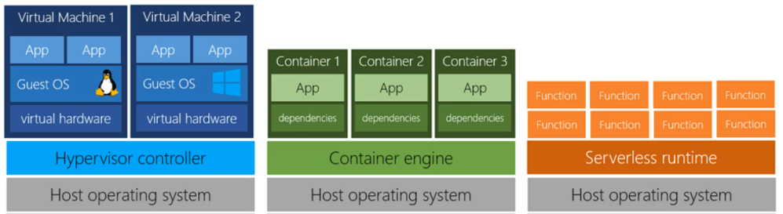

# Containers and serverless computing
Containers:
- like VMs minus the guest OS
- uses OS elements from host OS
    - no over head
    - fast reboot
- example
    docker

Serverless:
- app broken into functions
- only pay per function
- not charged when not used
- update them separately

See below:
VMs vs Containers vs Serverless computing

