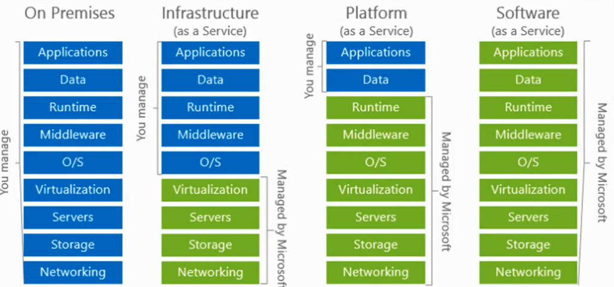

# Cloud ownership
Eat a Pizza
- what options do I have?
    1. Made in house  - **On Prem**
        - my own kitchen, gas, oven, dough, toppings, cooking time
    2. At a friend's Kitchen    - **Infra as a service**
        (Ok, you can come in and cook for yourself)
        - friend's kitchen, gas, oven
        - my own dough, toppings, cooking time
    3. At a girlfriend's Kitchen    - **Platform as a service**
        (My GF is sweet so, she prepares the dough for me)
        - GF's kitchen, gas, oven, dough
        - I add toppings, cooking time
    4. Pizza restaurant     - **Software as a service**
        - My responsibility - Zero
        - pay for what pizza i want

